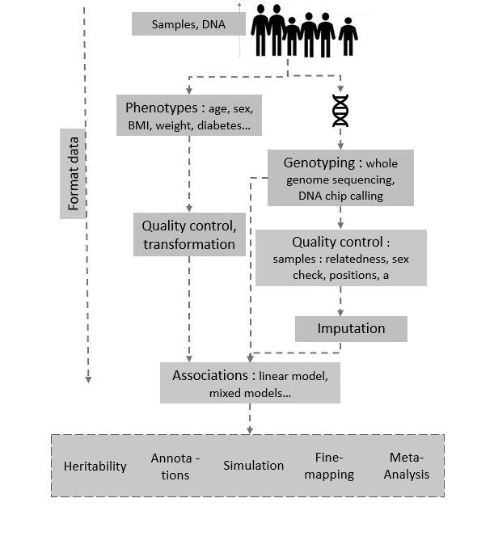

# Training exercise for GWAS

## GWAS context
# 🧬 Training Exercise for GWAS

## GWAS Context

Genome-Wide Association Studies (GWAS) are powerful research approaches used to identify genetic variants associated with specific traits or diseases.  
They involve scanning the entire genome of many individuals to detect differences in allele frequencies between affected (cases) and unaffected (controls) groups.  
These differences, often single-nucleotide polymorphisms (SNPs), can reveal genetic loci linked to disease risk, biological pathways, and potential therapeutic targets.

GWAS relies on large, well-characterized cohorts and careful data processing to ensure reliable results.  
The main steps include defining the sample, genotyping, performing rigorous quality control (QC), imputing missing genotypes, conducting association analyses, and interpreting significant results.

---

## Main Steps of a GWAS

### 1. Sample Definition and Collection
- Define clear inclusion/exclusion criteria.  
- Ensure balanced representation to avoid bias (e.g., sex, ancestry, case/control ratio).  
- Record relevant covariates (age, sex, site, lifestyle factors, etc.).

### 2. Genotyping
- Choose the appropriate genotyping platform (e.g., H3Africa array, GWAS array).  
- Consider cost, genomic coverage, and efficiency.

### 3. Quality Control (QC) of Genotypes
- Remove poorly genotyped SNPs or samples.  
- Identify potential genotyping errors or batch effects.
- verify relatedness using genetics data

### 4. QC for Population Structure (Admixture)
- Assess genetic ancestry using PCA or ADMIXTURE.  
- Detect population outliers or hidden relatedness.  
- Control for population stratification in association models.

### 5. QC of Phenotypes
- Check for outliers, missing data, and phenotype consistency.  

### 6. Imputation
- Infer untyped variants using a reference panel (e.g., 1000 Genomes, H3Africa, TOPMed).  
- Choose reference data that best matches your population’s ancestry.

### 7. Association Analysis
- Run appropriate models (linear or logistic regression).  
- Include relevant covariates (e.g., age, sex, PCs, site).  
- Evaluate test statistics (e.g., genomic inflation factor λ).

### 8. Post-Imputation and Interpretation
- Visualize results (Manhattan and QQ plots).  
- Extract significant loci (clumping, regional plots).  
- Annotate variants (genes, biological relevance).  
- Perform fine-mapping and replication if possible.

## Objective of the GWAS Exercise

Your collaborator Pr. Nephro Logist has conducted a study to identify **common genetic variants** associated with kidney function, using **eGFR** (estimated glomerular filtration rate) as a quantitative marker.  
They have sent you **raw genotype data** (in PLINK format) along with **phenotype information**. However, they suspect that:
- Some phenotype values may be incorrect.
- Some individuals may have been **mismatched** between genotype and phenotype data during processing.

---

## 🎯 Objective of the Exercise

The goal of this exercise is to:
1. Perform **quality control (QC)** on both phenotype and genotype data.  
2. Conduct a **Genome-Wide Association Study (GWAS)** for eGFR.  
3. Identify and extract **significant SNPs**.  
4. Generate **summary plots** (Manhattan, QQ, and regional association plots).

---

## 🧭 Steps overv ies

### **Part 0 — Understanding Your Data and Software**
* [`Data_beforeqc`](Data_beforeqc/README.md): dataset sent by your collaborators, containing genotype (PLINK format) and phenotype data.  
* [Description of software](softwares_description.md): overview of software used — `plink`, `plink2`, `R`, `admixture`, etc.

---

### **Part 1 — Genotyping Quality Control**
Genotype QC is a fundamental step before imputation or association analysis.  
The goal is to minimize **false positives** and **false negatives** by ensuring data integrity.

See: [Quality control](qc_steps1.md)

**Typical steps:**
- Remove samples and variants with high missingness.  
- Filter by minor allele frequency (MAF) and Hardy–Weinberg equilibrium (HWE).  
- Detect and remove duplicate samples or related individuals (using `PI_HAT`).  
- Verify **sex concordance** (genetic vs reported sex).  
- Identify **heterozygosity** and **missingness** outliers.

---

### **Part 2 — Population Quality Control**
Population structure (admixture) can bias association results and create spurious signals.  
The aim here is to detect outliers or sample swaps.

See: [Population genetics quality control](qc_steps2.md)

**Typical steps:**
- Perform **Principal Component Analysis (PCA)** to visualize population structure.  
- Run **ADMIXTURE** to estimate ancestry proportions.  
- Identify and handle population outliers.  
- Use top PCs as covariates in association testing.

---

### **Part 3 — Phenotype Quality Control**
Phenotype data must be cleaned, verified, and adjusted for covariates and outliers.

See: [Phenotype quality control](qc_steps3.md)

**Typical steps:**
- Check units and plausible ranges (e.g., serum creatinine in mg/dL or µmol/L, eGFR in mL/min/1.73 m²).  
- Detect and handle outliers (visual or statistical).  
- Define relevant **covariates**: age, sex, site, ancestry PCs, etc.

---

### **Part 4 — Association Analysis**
This is the main GWAS step, where you test for associations between genotypes and eGFR.

See: [Association](association.md)

**Key points:**
- Use **linear regression** for quantitative traits (e.g., eGFR).  
- Transform eGFR if not normally distributed (log or inverse-normal).  
- Include appropriate covariates (age, sex, PCs, site, etc.).  
- Use `plink2` or other GWAS tools for larger datasets or related samples.

---

### **Part 5 — Post-Association Analysis**
Identify independent significant loci, annotate top SNPs, and visualize your results.

See: [Post Association](post_association.md)

**Typical steps:**
- Perform **clumping** to define independent sentinel SNPs.  
- Annotate top variants (gene name, position, effect allele, etc.).  
- Create **Manhattan** and **QQ** plots.  
- Generate **regional association plots** for significant loci.  

